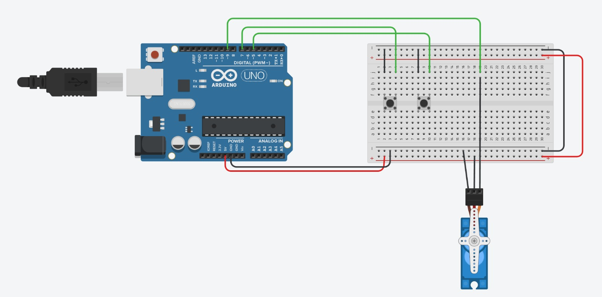

# Servo Motor

## Circuit Components:

Arduino Uno R3

Positional Micro Servo

Pushbutton(2)

## Circuit Installation Steps:

1- Connect the servo motor:

Connect the signal (control) wire of the servo to digital pin 9 on the Arduino board.
Connect the power wire (usually red) of the servo to the 5V pin on the Arduino.
Connect the ground wire (usually black or brown) of the servo to the GND pin on the Arduino.

2- Connect the left button:

Connect one leg of the left button to digital pin 7 on the Arduino.
Connect the other leg of the left button to the GND pin on the Arduino.

3- Connect the right button:

Connect one leg of the right button to digital pin 5 on the Arduino.
Connect the other leg of the right button to the GND pin on the Arduino.

## Code Explanation:

The code you provided is written for an Arduino using the Servo library. It initializes a servo motor and two buttons. The servo is controlled by the buttons: pressing the left button moves the servo to 0 degrees, and pressing the right button moves the servo to 180 degrees.

